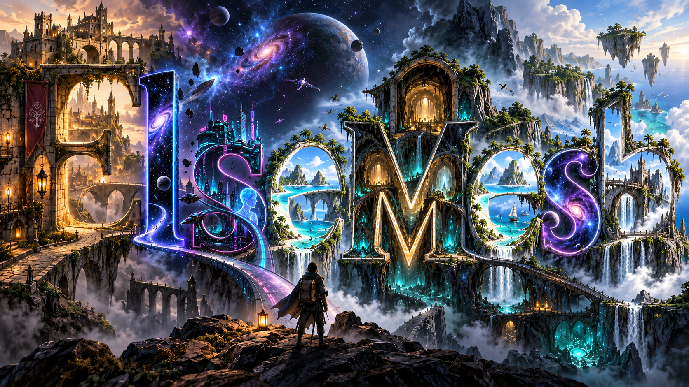

# ElseMesh

An experimental WebGPU island exploration game. Walk, sail and fly between
islands, explore the underwater cave and monorail, and collect a sedan delivered
to Bracken Quay by cargo ship. Fishing, trading and hunger are optional.

**[Play ElseMesh](https://lozknowles.github.io/ElseMesh/)**

This is a public experimental source release, not a finished or fully qualified
game. WebGPU and a capable desktop GPU are required. Frame rate and memory use
vary substantially; port traffic, detailed collision recovery, mobile support
and long multiplayer sessions still need broader testing.

## Run locally

Use Node.js 22.12 or newer (Node 24 recommended).

```sh
npm ci
npm run dev
```

Open the local address printed by Vite. Build with `npm run build`; `npm run
preview` serves the resulting static site. GitHub Pages hosts the single-player
game and local two-window demo. Internet multiplayer needs a separately
configured HTTPS/WebSocket room server; Pages does not host that server.
See [deployment examples](deploy/README.md). The public client and server use
ElseMesh protocol identifiers and environment variables; older invitations and
saved settings from the private prototype are not migrated.

## Controls

| Input | Action |
| --- | --- |
| WASD / mouse | Move and look |
| Shift / Space | Sprint / jump |
| E | Interact, board or leave a vehicle |
| WASD / Space / R in car | Drive / brake / recover |
| H | Settings |
| N | Map |
| K | Avatar chooser |
| M | Mute |
| F1 or ? | Full controls |

The cargo sequence can be reviewed with `?view=portCargoDelivery&quality=high&noAudio`.
Its delivery vehicle is MMCWorks' Generic Sedan Car, with separate animated
wheels and collision bounds checked against the actual model.

## Checks

```sh
npm test
npm run test:network
npm run test:security
npm run test:cargo
npm run test:vehicle-steering
npm run test:vehicle-material
npm run test:graphics
npm run test:renderer
npm run test:publication
npm run build
```

## Rendering performance

The 2 October renderer update shares scene transforms across passes and skips
unused water-depth and inactive postprocessing work. In a controlled six-view
Balanced test on Intel Arc, average FPS rose from 23.0 to 27.3 (+19.1%) at the
same resolution and quality. Five views improved; village was essentially flat.
This is a fixed-camera result, not a guarantee for gameplay or other hardware.
Long-frame hitches remain, including a worse cargo p99 in this run.
See the [method, limitations and raw evidence](docs/performance-2026-10-02/review.txt).

A follow-up adds distant forest batches, draw-submission reuse and conservative
distant-water optical simplification. A separate six-view comparison with these
switches off/on measured 28.5 to 29.3 FPS (+2.7%), with beach +9.5% and underwater
+7.6%; other views stayed within 1%. CPU submission wall time fell 24%, while
frame-time tails did not improve everywhere. Experimental depth ordering remains
disabled. See the [follow-up evidence and limitations](docs/performance-2026-10-02-stage-two/review.txt).

## Licensing and source

Game code is MIT except `tools/ivy_trial.py` (GPL-2.0-or-later); third-party assets retain their own terms. See [CREDITS.md](CREDITS.md)
and [vehicle credits](public/models/port/CREDITS.md). MMCWorks' sedan is CC BY 4.0.
OpenX traffic assets retain MPL-2.0 AND CC-BY-4.0; their notices and editable
source package accompany the game in [vehicle licensing](public/models/port/licensing/README.md).
Those licences do not grant endorsement or independent vehicle/character trademark rights.

This project's intended use is noncommercial. That intent does not add a new
noncommercial restriction to MIT, MPL or CC BY assets. Permission is being sought
for a separate DeLorean model; that model and its derivatives are excluded here.
The private prototype's Godzilla character asset is also excluded. The rest of
the island game runs without it. No private development history, internal
service configuration, private voice samples or permission correspondence is
included in this repository.

ElseMesh is maintained with Agent Control development assistance.
Original code and asset authorship notices are preserved.
