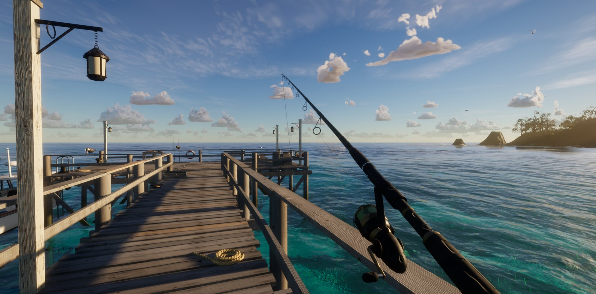

# Burning Horizons — Island Mystery

**Burning Horizons is an island mystery to explore and solve.** Arrive on a remote island, uncover a hidden cave, ride a concealed monorail beneath the sea, and follow an expedition's trail to a second island. Fishing is part of survival: keep a catch in the cooler and prepare it when hunger rises.

## Hosted multiplayer preview

The [hosted online preview](https://hpubuntu.taila22e8a.ts.net/play-online.html) runs from the experimental [`feature/networked-character-speech` branch](https://github.com/lozknowles/Burning-Horizons/tree/feature/networked-character-speech), which is ahead of this default branch. Two people can share a private room, see each other on the radar, exchange typed speech with **T**, and ride one boat with the host at the helm. The host's accepted private OmniVoice profile can generate audio when the separately hosted worker is healthy; Ed currently has text only. Browser playback and the shared boat still need a physical two-device gameplay check.

Rooms currently admit **two players**. See the [network node setup and three-player trial plan](https://github.com/lozknowles/Burning-Horizons/blob/feature/networked-character-speech/docs/networking/multi-player-nodes.md) for the present deployment and the changes needed before three or more can join one room. The full current preview status and controls are in the [preview branch README](https://github.com/lozknowles/Burning-Horizons/blob/feature/networked-character-speech/README.md).



## The journey

1. Walk the home island, explore the shore and take the boat around the western headland.
2. Follow the water channel into **UNDERNEATH**. Stop the boat in the deeper water before the landing, leave the helm, jump overboard and wade up the shallow stone ramp. The explorer is visible seated at the wheel, aboard and on foot.
3. Use the flashing electronic reader. Its door rises into the cave ceiling and reveals the lit station, platform and waiting train. Press **N** to see the two-island map after entry.
4. Board the two-way monorail. Its glass pressure tube crosses below the sea, with fish visible outside.
5. Explore the second island, read the expedition log in Station B, and locate the silent signal mast. The same train returns to the home island.

The mystery story is an evolving playable prototype. The existing signal objective has a first reveal; a longer investigation and ending are still to be built. The firearm is a finite-ammo survival sidearm with muzzle flash and reload; combat and damage are not yet implemented. The second island terrain and rail architecture are procedural in-game assets. UNDERNEATH was authored in Blender.

## Survival and the world

- Hunger falls during play. Press **B** to prepare and eat a fish from the cooler; low hunger slows walking.
- Fishing, fish trading, boat fuel and upgrades remain available as survival systems.
- The Steam79 Godzilla asset emerges offshore and walks toward the landing with a Blender-made walk cycle, falling water, heavy foot splashes, a trailing wake and foam crests pushed ahead of it.
- By default, the sky follows the computer's **local time**, with sunset, moon and stars. The Sky settings allow a manual time and accelerated preview.
- The original island includes a pier, village, reef, wildlife, whale, tropical vegetation and a simulated ocean.

## Controls

| Key | Action |
|---|---|
| W A S D / mouse | Move / look |
| Shift / Space | Sprint / jump or swim up |
| E | Interact with boat, cave door, monorail, logs and signal mast |
| N | Two-island map after finding Station A |
| G / left mouse / X | Equip sidearm / fire / reload |
| B | Prepare and eat a fish from the cooler |
| R / left mouse | Equip fishing rod / cast and reel while it is equipped |
| I or Tab | Cooler, fish log and inventory |
| V | Boat camera |
| L | Flashlight |
| H | Settings |
| T | Pause or resume manual time |
| M | Mute |
| F1 or ? | Full controls |

## Run and build

Requires a WebGPU-capable browser and GPU. The first launch may take a minute while shaders compile.

```sh
npm ci
npm run dev
npm test
npm run build
```

The local server uses http://127.0.0.1:5189/. The deployment workflow is `.github/workflows/deploy.yml`. GitHub Pages must be enabled for this repository and configured to use GitHub Actions before the public game URL works.

The local journey video is captured from the running game with `tools/video/journey-capture.js`, `tools/video/journey-route.mjs` and `tools/video/journey-receiver.mjs`. Its continuous curved boat course clears the pier before turning toward the cave. The game boat controller supplies buoyancy, trim, roll and spray during the time-compressed shot; normal driving uses its full physics controller. The boat stops afloat before the shallow ramp and the explorer jumps into the water. The capture continues through the station, undersea crossing, sunset and night arrival. The rendered video is kept outside the repository.

## Blender and world editing

`npm run world:export` exports the home island's heightfield and masks into `artifacts/world/` for Blender. [The Blender workflow](docs/BLENDER-MODDING.md) describes the cave model and import/export process. The cave GLB and layout are under `public/models/world/`. The prepared Godzilla asset is `public/models/godzilla/steam79-walk.glb`; `tools/blender/prepare_godzilla.py` documents its reduction and animation.

## Project status

The cave, monorail, second island, survival sidearm, hunger, local-time sky and Godzilla encounter are implemented in the current prototype. The longer mystery, combat consequences, broader second-island content, and full normal-controls route qualification remain work in progress. The schematic [world expansion map](docs/world-expansion-map.svg) and [design notes](docs/WORLD-EXPANSION-CONCEPT.md) describe the intended direction.

## Credits and license

Source code is MIT licensed under [LICENSE](LICENSE). Third-party assets keep their own licenses. See [CREDITS.md](CREDITS.md), including the required Steam79 attribution for the Godzilla model.
